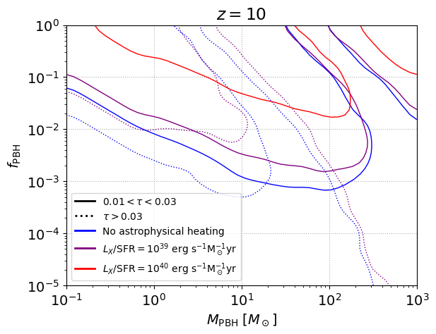

# 21cmForest_PBH

 

Python codes for computing the number of absorption features of the 21 cm forest in scenarios with Primordial Black Holes as Dark Matter.

See the paper [arXiv:2104.10695](https://arxiv.org/abs/2104.10695) for more details.

## Description of the code

The program computes the number of absorbers expected in Cold Dark Matter (CDM) and Primordial Black Holes (PBH) cosmologies. For that, the Intergalactic Medium (IGM) temperature is required. The code makes use of the temperature computed from semianalytic simulations carried out with [21cmFAST](https://github.com/andreimesinger/21cmFAST) ([arXiv:1003.3878](https://arxiv.org/abs/1003.3878)). The global outputs for several realizations, which include the temperature evolution, are included in the folder `21cmFiles`.

The main scripts are the following:

* `Absorbers.py`: main code to compute the number of absorption features for CDM and PBH models. It makes use of the temperature from the `21cmFiles` files, or employs the temperature previously interpolated from `InterpolateTemperature.py`. It calls the script `ImpactParam.py` for employing the effective cross sections if they are not previously calculated. It can also plot the smoothed bounds on the PBH parameter space calling `AbundanceBounds.py`.

* `ImpactParam.py`: computes the maximum impact parameter, which defines the effective cross section of a given halo mass.

* `InterpolateTemperature.py`: interpolates the IGM temperature from the `21cmFiles` files on a grid of the PBH mass and PBH fraction.

Several plotting scripts are also included:

* `PreliminaryPlots.py`: plots the gas density profile, the spin temperature and the optical depth.

* `PowerSpectrumPlots.py`: shows the power spectrum, the variance and the halo mass function.

* `TemperaturePlot.py`: creates a figure of the IGM temperature from the `21cmFiles` files.

* `AbundanceBounds.py`: interpolates a grid of bounds previously computed in `Absorbers.py` and plots the upper limits on the PBH abundance.

In the folder `Source`, several auxiliary routines are defined:

* `constants.py`: includes the definition of physical and cosmological constants, together with some parameters regarding the number of bins.

* `functions.py`: includes several useful cosmological functions, to compute the density profile, power spectrum, halo mass function and 21 cm quantities.

## Requisites

The code is written in Python3, and makes use of several Python libraries, which are:

* numpy
* matplotlib
* scipy
* pickle

The package for cosmological computations [Colossus](https://bdiemer.bitbucket.io/colossus/) is also employed.

## Citation

If you use the code, please link this repository, and cite [arXiv:2104.10695](https://arxiv.org/abs/2104.10695) and the DOI [10.5281/zenodo.4707447](https://doi.org/10.5281/zenodo.4707447).

## Contact

For comments, questions etc. you can reach me at <pablo.villanueva.domingo@gmail.com>
